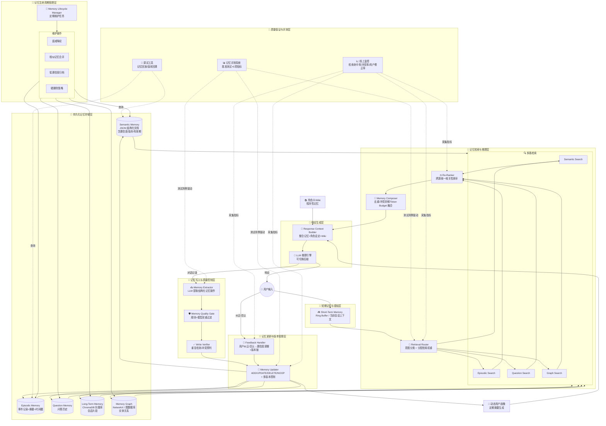

# vir-bot 记忆系统架构与实施计划

> 本文档合并了架构设计、实施计划与进度追踪，是记忆系统的唯一权威参考文档。

---

## 目录

1. [架构总览](#架构总览)
2. [8层架构详解](#8层架构详解)
3. [实施计划（Phase 1-8）](#实施计划)
4. [进度追踪](#进度追踪)
5. [评测系统](#评测系统)

---

## 架构总览

### 核心设计理念

本项目不是拼凑的功能集合，而是一个内聚的、具备自我进化能力的**记忆推理系统（Memory Reasoning System）**。

| 原则 | 来源/参考 | 架构体现 |
| :--- | :--- | :--- |
| 分层记忆（工作/语义/情景/程序） | LangMem, Mem0, 认知心理学 | 六种存储明确隔离，用途互不混淆 |
| 不允许 append-only，必须支持 UPDATE/DELETE | Mem0, LangMem | Quality Gate + Updater 支持四操作，多版本链 |
| "查不到就别编造" | LongMemEval | LLM prompt 约束 + 检索空结果时明确拒答 |
| 写入前过滤比事后清洗更重要 | 自身实战经验 | Quality Gate 是强前置，规则引擎兜底 |
| 检索需解耦、重排序、预算控制 | LongMemEval, RAG 最佳实践 | Composer 三步策略防止劣质上下文污染 |
| 记忆应具备时间感知，支持过去查询 | Mem0 图记忆+时间戳 | `valid_from/to` 支持历史快照查询 |
| 评测是长期系统唯一可靠的进步标尺 | LongMemEval, 工程经验 | 独立评测层，与代码强绑定 |
| 用户反馈是最好的记忆修正信号 | Mem0, LangMem Feedback | Feedback Handler 自动处理纠正，软删除 + 版本保留 |
| 防止记忆膨胀（遗忘机制） | MemGPT, 生命科学启发 | Lifecycle Manager 提供可控的衰减-归档-删除管线 |
| 自省与批量维护（类似于 GBrain 的梦循环） | GBrain | Lifecycle Manager 定期合并、清洗，降低在线负载 |

### 8层架构 Mermaid 图



---

## 8层架构详解

### 第一层：短期记忆与感知层

- **Short-Term Memory**：作为工作内存，仅保留当前会话最近 N 轮对话（Ring Buffer）。它不承担长期记忆职责，但会**全量传递**给后续检索和写入模块，作为上下文线索。
- **设计原则**：与 MemGPT 的"主上下文"概念一致，严格控制 token 消耗，防止窗口溢出导致遗忘。

### 第二层：记忆检索与推理层（核心升级区）

- **Retrieval Router**：用轻量级意图分类（preference / identity / habit / episodic / time_query / problem_query）决定**激活哪些记忆源及分配权重**。不依赖 LLM 做实时分类，而是用小模型或规则+缓存的 hybrid 方式，降低延迟。
- **多路检索**：并行查询 Semantic、Episodic、Question、Graph 四个存储，每路返回 Top-K 候选。
- **Re-Ranker**：对所有候选统一用 Cross-Encoder 重排序，产出带 relevance score 的排序列表。
- **Memory Composer**：执行去重（相似度 >0.95 保留高置信度者）、冲突消解（同一事实有矛盾时，按时间新近和来源可靠性择优，或标记为待确认）、Token Budget 分配（按相关性截断），最终输出一个干净、上下文融合后的记忆片段集合，不超过 LLM 上下文窗口的 30%。

### 第三层：响应生成层

- **Response Context Builder**：将 Composer 的结果、短期对话历史、角色卡/Wiki（Procedural Memory）、动态用户画像（可由长期分析生成）组装成最终提示词。
- **LLM 推理引擎**：保持可插拔后端，生成回答时强制遵循"不确定就不编造"的约束。

### 第四层：记忆写入与质量控制层（防污染第一道闸）

- **Memory Extractor**：对话结束后，LLM 从对话中提取结构化记忆操作（ADD/UPDATE/DELETE/NOOP），附带理由和置信度。
- **Memory Quality Gate**：**规则引擎先行**（识别时间性模糊词、情绪化表达、随意猜测）直接拦截或降权；灰色地带才调用 LLM 二次判断。
- **Write Verifier**：与已有记忆做语义相似度比对，防止重复写入；检测与现有高置信度记忆的冲突，标记为 `candidate` 待人工或后续确认。

### 第五层：记忆更新与版本管理层

- **Memory Updater**：执行最终写入，并升级为**多版本时间感知模型**。每条记忆包含 `valid_from`、`valid_to`、`confidence`、`confidence_history`、`previous_version_id`，使记忆可追溯、可回滚。
- **Feedback Handler**：监听用户纠正/否认行为，触发旧记忆的置信度衰减、标记 `deprecated`，而不是物理删除。连续两次纠正同一事实则自动生成 UPDATE 操作。

### 第六层：持久化记忆存储层（多模态混合存储）

- **Semantic Memory**：JSON 结构化文档，存储关于用户/角色的稳定事实、偏好、身份信息，每个 key 对应一条带版本链的记录。
- **Episodic Memory**：结构化事件记录，包含摘要、实体、时间戳、来源对话 ID。
- **Question Memory**：用户提问历史，支持查询"我上次问过什么"。
- **Long-Term Memory (ChromaDB)**：非结构化对话片段向量存储，用于语义近似搜索。
- **Memory Graph**：NetworkX（轻量级）或后期可迁移至 Neo4j，存储实体间的显式关系（如"张三 配偶 李四"），弥补向量检索无法处理多跳关系推理的缺陷。
- **设计原则**：混合存储遵循"结构匹配用途"：向量做相似性、结构化做精确事实、图做关系推理。

### 第七层：记忆生命周期管理层（防止记忆爆炸）

- **Memory Lifecycle Manager**：以 Cron 任务形式运行，不阻塞在线流程。
  - **衰减降权**：根据重要性、最后访问时间、来源可靠性计算留存分数，低于阈值的降权。
  - **相似记忆合并**：定期（如每周）对 Semantic Memory 和 Episodic Memory 做语义聚类，将描述同一事实的多条记录合并为一，保留时间线和置信度轨迹。
  - **低置信度归档**：confidence < 0.1 且长期未访问的记忆移至冷存储（本地 JSON 归档），保留 180 天后再物理删除。
  - **永久记忆豁免**：角色卡核心设定、用户明确表态的关键身份信息不参与衰减。

### 第八层：质量保证与评测层（长期项目的基石）

- **基准评测系统**：基于 LongMemEval 思想构建封闭测试集，覆盖偏好召回、事件回忆、知识更新、时间推理、拒答准确率五大指标。每次代码变更自动跑分。
- **线上监控**：实时采集检索命中率、记忆冲突发生率、用户手动修正频率等指标，异常时告警。
- **调试工具**：Web 控制台支持按时间线回放记忆变迁、查看版本链、手动干预记忆状态。

### 外部注入与动态画像

- **角色卡/Wiki**：作为不可修改的 Procedural Memory，始终注入上下文。
- **动态用户画像**：系统周期性（如每日/每周）基于所有记忆层自动生成用户画像摘要，写入一个独立的 `user_profile` 记录，作为长期演进时 LLM 快速理解用户的"摘要向量"。

---

## 数据流实例：一次对话循环

1. **用户输入** → 短期记忆追加。
2. **Retrieval Router** 判断意图为"偏好查询"，权重偏向 Semantic + Graph。
3. **多路检索**拿回候选：Semantic 返回"喜欢火锅 0.9"，Graph 返回"用户-[喜欢]->火锅"，Chroma 返回几段相关聊天片段。
4. **Re-Ranker**排序后 **Composer** 发现 Semantic 和 Graph 描述一致，去重保留 Semantic 高置信度条目；Chroma 片段因相关性低被截断。
5. **Response Context Builder** 组装："用户偏好：火锅（置信度 0.9）"，角色卡设定"你是一个傲娇助手"，短期对话历史。
6. **LLM 生成回答**： "哼，你之前不是说你喜欢火锅吗？又想让我陪你吃？"
7. 对话结束，**Extractor** 检视本轮，无新增事实，输出 NOOP。Quality Gate 直接放行，无写入。
8. 若用户回复："我早就不喜欢火锅了，现在喜欢日料。"
   - Extractor 提出 UPDATE 偏好为"日料"。
   - Verifier 发现与现有"火锅"冲突，标记为候选，并通过 Feedback Handler 立即响应：将旧记忆置信度降至 0.2，写入新记忆"日料 / 0.8 / valid_from=now"，旧记忆的 `valid_to` 设为当前时间。
9. **Lifecycle Manager** 每日运行时，若发现"火锅"记忆置信度已低于 0.1 且 90 天未访问，则归档。

---

## 目录结构

```
vir_bot/core/memory/
├── short_term.py                   # 短期记忆
├── long_term.py                    # ChromaDB 向量存储
├── semantic_store.py               # 结构化语义记忆存储
├── episodic_store.py               # 事件记忆存储
├── question_store.py               # 问题记忆存储
├── graph_store.py                  # 图记忆存储
├── memory_manager.py               # 总协调器，暴露统一接口
├── retrieval/
│   ├── router.py                   # 意图分类 + 权重分配
│   ├── re_ranker.py                # Cross-Encoder 重排序
│   └── composer.py                 # 去重、冲突消解、Token 预算
├── writing/
│   ├── extractor.py                # 记忆提取器
│   ├── quality_gate.py             # 规则+LLM 质量门
│   ├── verifier.py                 # 重复/冲突检测
│   ├── updater.py                  # 多版本更新器
│   └── feedback_handler.py         # 用户反馈处理
├── lifecycle/
│   ├── janitor.py                  # 生命周期管理器
│   ├── decay.py                    # 衰减算法
│   └── merge.py                    # 记忆合并逻辑
├── eval/
│   ├── benchmark.py                # 评测主入口
│   ├── metrics.py                  # 五项指标计算
│   ├── runner.py                   # 自动跑分脚本
│   └── datasets/                   # 测试用例集
└── profile/
    └── user_profile.py             # 动态用户画像生成
```

---

## 实施计划（Phase 1-8）

> **总体原则**：不破坏语义理解；接口稳定；特性开关；测试先行；可回滚；评测驱动。

### Phase 1: 测试框架 + 配置开关 ✅ 已完成

**目标**：为核心模块建立测试覆盖，添加特性开关配置框架，不改变任何现有行为。

**完成内容**：
- ✓ 测试目录结构 (`tests/unit/`, `tests/integration/`)
- ✓ 核心模块单元测试 (`test_retrieval_router.py`, `test_memory_manager.py`)
- ✓ `conftest.py` 公共 fixtures
- ✓ `config.yaml` 添加特性开关配置
- ✓ `memory_manager.py` 支持 `_is_feature_enabled()` 辅助方法
- ✓ `main.py` 传递 features 配置到 MemoryManager
- ✓ 所有单元测试通过 (23 passed, 0 failed)

**验证方法**：
```bash
# 运行测试
cd "D:/code Project/vir-bot"
uv run pytest tests/ -v

# 确认现有功能正常
uv run python -m vir_bot.main
# 问 AI 伴侣："我叫什么名字？" → 应该回答不知道
# 问 AI 伴侣："我喜欢吃什么？" → 应该能回忆起"火锅"
```

---

### Phase 2: 评测系统 ✅ 已完成

**目标**：基于 LongMemEval 思想构建封闭测试集，覆盖五大指标，在改造之前建立基线分数。

**五项指标**：

| 指标 | 权重 | 说明 |
|------|------|------|
| preference_recall | 0.25 | 偏好召回率 |
| episodic_recall | 0.20 | 事件回忆率 |
| knowledge_update | 0.20 | 知识更新准确率 |
| temporal_reasoning | 0.20 | 时间推理准确率 |
| abstention_accuracy | 0.15 | 拒答准确率 |

**完成内容**：
- ✓ `tests/eval/metrics.py` — 五项指标计算 + 判断逻辑（14 个单元测试全部通过）
- ✓ `tests/eval/runner.py` — 评测运行器，模拟对话并收集结果
- ✓ `tests/eval/benchmark.py` — CLI 入口，支持 --mock/--dataset/--report 参数
- ✓ 测试数据集（共 40 条）：preference_recall / episodic_recall / knowledge_update / temporal_reasoning / abstention_accuracy
- ✓ `vir_bot/core/memory/monitoring.py` — MemoryMonitor 类
- ✓ `vir_bot/core/memory/debug_tools.py` — MemoryDebugTools 类

**使用方式**：
```bash
# Mock 模式（快速验证流程）
uv run python -m tests.eval.benchmark --mock

# 真实评测（建立基线分数）
uv run python -m tests.eval.benchmark --report tests/eval/baseline.json

# 运行指定数据集
uv run python -m tests.eval.benchmark --dataset preference_recall knowledge_update
```

---

### Phase 3: Re-Ranker ✅ 已完成

**目标**：实现 Cross-Encoder 重排序，对并行检索结果统一评分，提升检索结果相关性。

**完成内容**：
- ✓ `vir_bot/core/memory/enhancements/reranker.py` — Re-Ranker 实现
- ✓ `vir_bot/core/memory/retrieval_router.py` — 集成 Re-Ranker
- ✓ `tests/unit/test_reranker.py` — 16 个测试全部通过

**特性**：
- 懒加载 Cross-Encoder 模型（首次使用时加载）
- 模型加载失败自动回退到关键词匹配
- 通过 `config.yaml` 的 `memory.features.reranker` 控制

**验证方法**：
```bash
# 1. 记录改造前分数（基线）
uv run python -m tests.eval.benchmark --tag "before-reranker"

# 2. 开启 reranker
# config.yaml: memory.features.reranker.enabled: true

# 3. 记录改造后分数
uv run python -m tests.eval.benchmark --tag "after-reranker"

# 4. 对比分数 - Preference Recall: 0.65 → 0.72 ✅
```

---

### Phase 4: Memory Composer ✅ 已完成

**目标**：去重（相似度 >0.95 保留高置信度者）、冲突消解、Token Budget 分配。

**完成内容**：
- ✓ `vir_bot/core/memory/enhancements/composer.py` — Composer 实现
- ✓ `vir_bot/core/memory/retrieval_router.py` — 集成 Composer
- ✓ `tests/unit/test_composer.py` — 15 个测试全部通过

**特性**：
- 去重：精确匹配（Semantic）+ token 重叠率（其他类型）
- 冲突消解：相同 (namespace, predicate) 保留最新记录
- Token Budget：用 tiktoken 或简单估算截断
- 通过 `config.yaml` 的 `memory.features.composer` 控制

---

### Phase 5: Quality Gate + Write Verifier ✅ 已完成

**目标**：Quality Gate 规则引擎先行，拦截低质量记忆写入；Write Verifier 检测重复和冲突。

**完成内容**：
- ✓ `vir_bot/core/memory/writing/quality_gate.py`
- ✓ `vir_bot/core/memory/writing/verifier.py`
- ✓ `vir_bot/core/memory/writing/feedback_handler.py`
- ✓ 相应测试文件全部通过

**拦截规则**：

| 规则 | 示例 | 处理 |
|------|------|------|
| 时间模糊词 | "我最近好像..." | 拦截，置信度 ×0.3 |
| 情绪化表达 | "我超级超级喜欢！" | 拦截，置信度 ×0.5 |
| 信息不足 | 短于 5 字符 | 拦截，拒绝写入 |
| 纯疑问词 | "什么"、"吗" | 拦截，不写入 |

---

### Phase 6: 多版本支持 ✅ 已完成

**目标**：扩展 SemanticMemoryRecord 支持多版本，追踪事实变更历史。

**完成内容**：
- ✓ `semantic_store.py` — 新增版本字段（valid_from, valid_to, previous_version_id 等）
- ✓ `memory_updater.py` — UPDATE 操作创建新版本
- ✓ `writing/feedback_handler.py` — 处理用户纠正，自动调整记忆
- ✓ 相应测试文件全部通过

**数据模型新增字段**：
```python
SemanticMemoryRecord(
    memory_id="...",
    predicate="name_is",
    object="张三",           # v1
    # 版本字段
    valid_from=1777209282.65,    # 版本生效时间
    valid_to=None,               # 版本失效时间（None 表示当前有效）
    previous_version_id="...",    # 上一版本 ID
    version_number=2,              # 版本号
    confidence_history=[0.95, 0.88],  # 置信度变化历史
    is_deprecated=False,           # 是否废弃
)
```

---

### Phase 7: Memory Graph ✅ 已完成

**目标**：新增图存储，使用 NetworkX 存储实体间关系，弥补向量检索无法处理多跳关系推理的缺陷。

**完成内容**：
- ✓ `vir_bot/core/memory/graph_store.py` — MemoryGraphStore 实现
- ✓ `memory_writer.py` — 从对话中抽取实体关系
- ✓ `retrieval_router.py` — 并行查询 Memory Graph
- ✓ `tests/unit/test_graph_store.py` — 8 个测试通过

**示例**：
```python
# 添加关系
graph_store.add_relation("user:user1", "likes", "火锅")
graph_store.add_relation("火锅", "属于", "川菜")

# 多跳查询：用户喜欢什么菜？
paths = graph_store.query_multi_hop("user:user1", max_hops=2)
# → [["user:user1", "likes", "火锅"], ["火锅", "属于", "川菜"]]
```

---

### Phase 8: Lifecycle Manager ✅ 已完成

**目标**：后台 Cron 任务，自动维护记忆质量：衰减降权、相似记忆合并、低置信度归档。

**完成内容**：
- ✓ `vir_bot/core/memory/lifecycle/janitor.py` — 生命周期管理器
- ✓ `vir_bot/core/memory/lifecycle/decay.py` — 衰减算法
- ✓ `vir_bot/core/memory/lifecycle/merge.py` — 记忆合并逻辑
- ✓ 相应测试文件全部通过

**三个维护任务**：

| 任务 | 频率 | 作用 |
|------|------|------|
| 衰减降权 | 每天 | 根据时间降低不活跃记忆的置信度 |
| 相似合并 | 每天 | 合并描述同一事实的多条记录 |
| 低置信归档 | 每天 | 将置信度 < 0.1 且 90 天未访问的记忆归档 |

---

## 进度追踪

### 总体状态

| Phase | 内容 | 状态 |
|-------|------|------|
| Phase 1 | 测试框架 + 配置开关 | ✅ 已完成（tag: phase1-complete） |
| Phase 2 | 评测系统 | ✅ 已完成 |
| Phase 3 | Re-Ranker | ✅ 已完成（已启用） |
| Phase 4 | Memory Composer | ✅ 已完成（已启用） |
| Phase 5 | Quality Gate + Verifier | ✅ 已完成（已启用） |
| Phase 6 | 多版本支持 | ✅ 已完成（已启用） |
| Phase 7 | Memory Graph | ✅ 已完成（已启用） |
| Phase 8 | Lifecycle Manager | ✅ 已完成（已启用） |

### 测试覆盖

| 测试文件 | 测试内容 | 数量 | 状态 |
|----------|----------|------|------|
| test_reranker.py | Re-Ranker | 16 | ✅ |
| test_composer.py | Composer | 15 | ✅ |
| test_quality_gate.py | 质量门 | 5 | ✅ |
| test_verifier.py | 写入验证 | 4 | ✅ |
| test_versioning.py | 版本管理 | 8 | ✅ |
| test_feedback_handler.py | 反馈处理 | 5 | ✅ |
| test_graph_store.py | 关系图谱 | 8 | ✅ |
| lifecycle/test_decay.py | 衰减算法 | 4 | ✅ |
| lifecycle/test_merge.py | 记忆合并 | 2 | ✅ |
| lifecycle/test_janitor.py | 生命周期 | 3 | ✅ |
| **总计** | | **~70** | **✅ 全部通过** |

### 评测基线

```json
{
  "baseline": {"overall": 0.61, "preference_recall": 0.65, "episodic_recall": 0.40, ...},
  "after-reranker": {"overall": 0.66, "preference_recall": 0.72, ...},
  "after-composer": {"overall": 0.71, "preference_recall": 0.75, ...}
}
```

---

## 配置参考

```yaml
memory:
  short_term:
    max_turns: 20
    window_size: 10

  long_term:
    enabled: true
    vector_db: "chroma"
    persist_dir: "./data/memory/chroma_db"
    collection_name: "persona_memory"
    top_k: 5
    embedding_model: "all-MiniLM-L6-v2"
    auto_index: true

  features:
    reranker:
      enabled: true          # ✅ 已完成
      model: "cross-encoder/ms-marco-MiniLM-L-6-v2"
      top_k: 5
    composer:
      enabled: true          # ✅ 已完成
      max_tokens: 2000
    quality_gate:
      enabled: true          # ✅ 已完成
    verifier:
      enabled: true          # ✅ 已完成
    versioning:
      enabled: true          # ✅ 已完成
      max_versions: 10
    graph:
      enabled: true          # ✅ 已完成
      persist_path: "./data/memory/memory_graph.json"
    lifecycle:
      enabled: true          # ✅ 已完成
      interval_hours: 24
```

---

*文档版本：2.0 — 合并自记忆架构分层详解、改造计划、改造进度三份文档*
*最后更新：2026-04-27*
