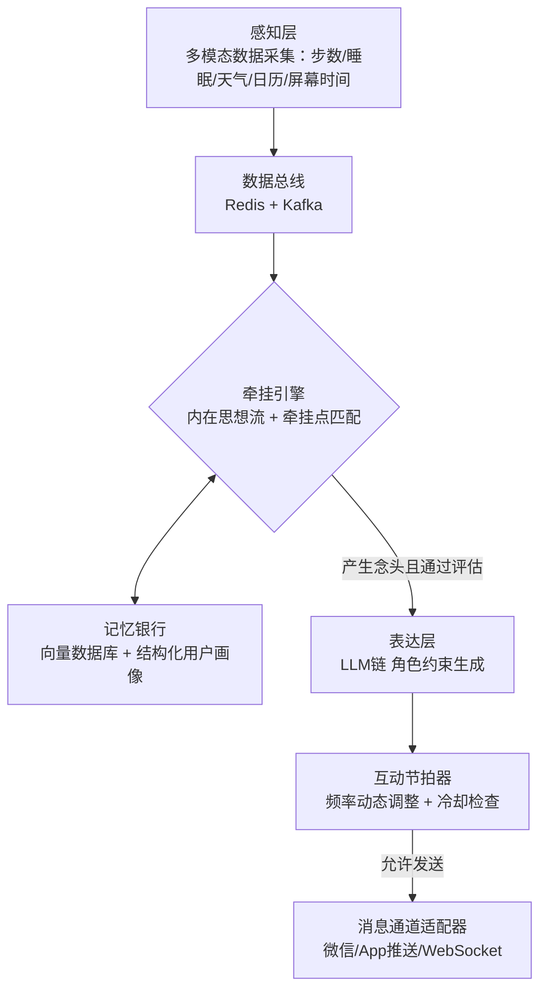

# AI伴侣主动消息系统：牵挂驱动型共生框架

## 1. 项目概述

本项目旨在构建一个具备**情感节奏感**和**情境智能**的AI伴侣主动消息系统。系统不再依赖固定时间或事件的“闹钟式”触发，而是通过持续感知用户状态、生成内在“牵挂念”，并基于角色一致性动态生成恰当时机的主动问候，从而实现从“被动响应”向“主动陪伴”的进化。

核心设计理念：
- **从“触发-响应”到“感知-牵挂”**
- **从固定规则到内在动机驱动**
- **从通用播报到角色化、情境化表达**
- **尊重交互边界，提供克制的陪伴感**

## 2. 系统架构总览

整个系统由四个核心层次组成：感知层、牵挂引擎层、表达层和互动节拍器。数据在流水线中流动，逐步完成“原始数据 → 状态标签 → 牵挂念头 → 主动消息”的转化。



## 3. 模块目录结构

项目基于 Python 生态构建，推荐使用 `poetry` 管理依赖，目录结构如下：

text

```
proactive-companion/
├── README.md
├── pyproject.toml
├── config/
│   ├── settings.yaml          # 全局配置（API密钥、阈值、人设等）
│   └── persona/               # 角色人设提示词模板
│       ├── gentle_assistant.json
│       └── tsundere_scholar.json
├── src/
│   ├── perception/            # 感知层
│   │   ├── collectors/        # 数据采集器
│   │   │   ├── health_collector.py      # 健康步数、睡眠等
│   │   │   ├── calendar_collector.py    # 日历事件
│   │   │   ├── weather_collector.py     # 天气信息
│   │   │   └── screen_time_collector.py # 屏幕使用时间
│   │   ├── fusion.py          # 数据融合与状态标签生成
│   │   └── state_cache.py     # Redis 实时状态缓存接口
│   ├── concern_engine/        # 牵挂引擎（核心）
│   │   ├── inner_stream.py    # 内在思想流异步循环
│   │   ├── concern_trigger.py # 牵挂触发器：事件到达与周期性检查
│   │   ├── concern_evaluator.py # LLM牵挂点价值评估与决策
│   │   └── motivation.py      # 动机模型（强度阈值、衰减等）
│   ├── memory/                # 记忆银行
│   │   ├── vector_store.py    # 向量数据库操作（Chroma/Milvus）
│   │   ├── user_profile.py    # 结构化用户画像（SQL/ORM）
│   │   └── retriever.py       # 上下文与相关记忆检索器
│   ├── expression/            # 表达层
│   │   ├── prompt_builder.py  # 动态提示词构建（注入记忆、状态、人设）
│   │   ├── message_generator.py # LLM 消息生成链（LangChain LCEL）
│   │   └── templates/         # 表达风格模板（关怀、提醒、好奇等）
│   ├── interaction/           # 互动节拍器与分发
│   │   ├── rhythm_manager.py  # 频率动态调整、冷却管理
│   │   ├── session_state.py   # 会话状态追踪
│   │   └── dispatcher.py      # 统一消息分发适配器
│   └── utils/                 # 公共工具
│       ├── llm_client.py      # LLM 统一调用封装
│       ├── db.py              # 数据库连接管理
│       └── logger.py
├── tests/                     # 单元与集成测试
├── docs/                      # 设计与论文参考
│   ├── design_notes.md
│   └── references.md          # 相关论文清单
└── scripts/                   # 启动与部署脚本
    └── start_companion.sh
```


## 4. 模块功能说明

### 4.1 感知层

负责从多个数据源采集原始信号，融合生成高层次用户状态标签（如“处于通勤中”、“睡眠不足”、“运动后”），并写入实时缓存。

- **数据采集器**：对接不同 API 或设备数据（健康、日历、天气等）。
- **`fusion.py`**：清洗、聚合数据，生成结构化标签并存储至 `state_cache`。
- **`state_cache.py`**：基于 Redis 维护一个带 TTL 的用户状态快照，键如 `user:{id}:state`。

### 4.2 牵挂引擎（核心）

系统主动性的决策中枢，模拟人类“想起某人近况”的心理过程。

- **内在思想流（`inner_stream.py`）**：后台异步循环，定期将当前状态与长期记忆组合，生成“念头”（如“他昨晚没睡好，现在会不会在补觉？”）。
- **牵挂触发器（`concern_trigger.py`）**：监听新数据到达事件或定时启动，调用内在思想流。
- **动机评估（`concern_evaluator.py` / `motivation.py`）**：使用 LLM 对念头打分，结合规则（免打扰、阈值、衰减）判定是否进入生成环节。

### 4.3 记忆银行

为用户对话和关键事件提供持久化存储与检索。

- **向量数据库**：存储对话片段、事件摘要的嵌入表示，支持语义检索。
- **用户画像**：结构化存储用户偏好、习惯、重要日期等动态更新的属性。
- **检索器**：根据当前情境和念头，返回最相关的历史记忆，注入表达层。

### 4.4 表达层

将牵挂念头转化为符合角色人设的自然语言消息。

- **`prompt_builder.py`**：组合“人设提示词 + 当前情境 + 牵挂内容 + 相关记忆 + 语气要求”生成完整 Prompt。
- **`message_generator.py`**：利用 LangChain LCEL 编排调用 LLM，输出最终消息。
- **`templates/`**：不同表达风格的少量样本模板，控制语气一致性。

### 4.5 互动节拍器与分发

保障交互节奏，避免过度打扰。

- **节奏管理（`rhythm_manager.py`）**：根据用户回复率、互动热度动态调整主动消息频次，并实施冷却时间。
- **会话状态（`session_state.py`）**：记录最后交互时间、是否已读未回等。
- **分发器（`dispatcher.py`）**：将生成的消息通过对应平台 API（如微信机器人、Telegram Bot、自定义 App 推送）发送。

## 5. 相关研究论文

以下是支撑本框架设计的前沿方向与关键文献索引，已按主题分类。

### 5.1 内在思想流 (Inner Thought & Proactive Turn-taking)

- *Proactive Conversational Agents with Inner Thoughts*
  T. Lee et al., arXiv, 2024.
  提出基于内在动机思想的主动对话框架，用持续运行的内心独白决定开口时机。

### 5.2 目标驱动与强化学习 (Goal-Driven & RL)

- **LDPP** – *Simulation-Free Hierarchical Latent Policy Planning for Proactive Dialogues*
  Z. Chen et al., AAAI, 2025.
  使用 VAE 挖掘潜层对话策略，再通过分层强化学习训练高层规划器。
- **JoTR** – *A Joint Transformer and Reinforcement Learning Framework for Dialogue Policy Learning*
  Y. Wang et al., LREC-COLING, 2024.
  将对话策略生成转化为 Transformer 的 Token 级输出，提升动作灵活性。
- **Adaptive-TOD** – *An LLM-driven and adaptive agent for diverse interaction modes*
  L. Zhang et al., Neurocomputing, 2025.
  面向任务型对话的主动策略适应。
- **Target-constrained Bidirectional Planning for Generation of Target-oriented Proactive Dialogue**
  J. Li et al., ACM TOIS, 2024.
  目标导向的双向规划算法用于主动对话生成。
- **UPC** – *Enhancing User-Oriented Proactivity in Open-Domain Dialogues with Critic Guidance*
  H. Liu et al., IJCAI, 2025.
  使用Critic模型增强以用户为中心的开放性主动对话。

### 5.3 意图预测与情境感知 (Intent Prediction & Context Awareness)

- **AV-EmoDialog** – *Chat with Audio-Visual Users Leveraging Emotional Cues*
  K. Hu et al., arXiv, 2024.
  通过音视频情感线索驱动共情对话策略。
- **ESDP** – *An emotion-sensitive dialogue policy for task-oriented dialogue system*
  Scientific Reports, 2024.
  融合情感敏感策略的对话系统。
- *Forecasting Live Chat Intent from Browsing History*
  X. Li et al., arXiv, 2024.
  利用浏览历史预测实时交互意图。
- **PaRT** – *Enhancing Proactive Social Chatbots with Personalized Real-Time Retrieval*
  S. Reddy et al., 2025.
  结合个性化实时检索增强主动社交聊天机器人。
- **ProAgent** – *Harnessing On-Demand Sensory Contexts for Proactive LLM Agent Systems*
  W. Guo et al., 2025.
  利用按需传感器上下文构建主动 LLM 智能体。
- **ZIA** – *A Theoretical Framework for Zero-Input AI*
  M. Patel et al., 2025.
  零输入 AI 的理论框架，强调主动预测与行动。

### 5.4 双系统架构与实时交互 (Dual-Process & Real-Time)

- **ProAct** – *Proactive Agent with Dual-System Architecture for Real-Time Dialogue*
  Peking University, 2025.
  结合“快行为系统”与“慢认知系统”实现实时流畅的主动交互。