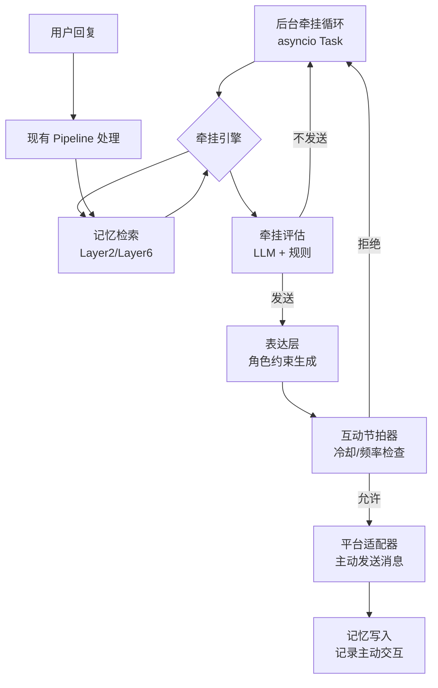

# 主动消息系统实现框架（牵挂驱动型）

## 1. 概述

基于《牵挂驱动型AI伴侣主动消息方案》，结合 vir-bot 现有架构调整后的实现框架。核心目标：让 AI 伴侣具备自主主动交互能力，基于已有记忆和对话历史生成牵挂，主动发送消息。

设计原则：
- 复用现有架构，不重复造轮子
- 评测驱动，每次迭代确保分数单调不减
- 特性可配置开关，默认关闭
- 优先基于对话历史和记忆驱动，不依赖外部硬件数据

## 2. 原方案评估

### 2.1 可行性
- 思路完全契合 vir-bot 的 AI 伴侣定位
- 8 层记忆系统已完备，可直接复用（Layer2/Layer6 检索、Layer5 版本管理等）
- 现有组件可复用：角色卡系统、AI Provider、平台适配器、Pipeline 编排

### 2.2 调整点（原方案不足）
1. **感知层简化**：优先基于对话历史和记忆生成牵挂，不依赖外部硬件数据（健康/日历/屏幕时间等），外部数据作为可选扩展模块
2. **技术栈对齐**：复用项目现有栈（asyncio / FastAPI / ChromaDB / 现有 AI Provider），不引入 LangChain / Redis / Kafka 等新依赖
3. **目录整合**：融入现有 `vir_bot/` 目录结构，不单独建项目
4. **评测配套**：新增主动消息评测指标，符合项目评测驱动原则
5. **特性开关**：通过 `config.yaml` 控制启用/关闭

## 3. 系统框架

### 3.1 交互流程



### 3.2 核心层次
1. **牵挂引擎层**：基于记忆和用户状态生成牵挂念头，评估是否值得发送
2. **表达层**：结合角色卡、记忆、牵挂内容生成符合人设的消息
3. **互动节拍器**：管理发送频率、冷却时间，避免过度打扰
4. **集成层**：对接现有记忆系统、Pipeline、平台适配器

## 4. 项目结构

```
vir_bot/
├── core/
│   ├── proactive/                # 主动消息核心模块（新增）
│   │   ├── __init__.py
│   │   ├── concern_engine.py     # 牵挂引擎：念头生成、评估触发
│   │   ├── expression.py         # 表达层：消息生成
│   │   ├── rhythm_manager.py     # 互动节拍器：频率、冷却管理
│   │   ├── state_tracker.py      # 用户状态追踪（基于记忆和对话）
│   │   └── evaluator.py          # 牵挂评估：LLM 打分 + 规则
│   ├── pipeline/                 # 现有 Pipeline，扩展支持主动消息源
│   ├── memory/                   # 现有记忆系统，直接复用
│   ├── character/                # 现有角色卡，直接复用
│   └── ...
├── platforms/                    # 现有平台适配器，扩展主动发送接口
│   ├── qq_adapter.py
│   ├── discord_adapter.py
│   └── wechat_adapter.py
├── config.py                     # 扩展配置加载
└── main.py                       # 扩展入口，启动牵挂后台循环
tests/
├── unit/
│   └── test_proactive/           # 主动消息单元测试（新增）
│       ├── test_concern_engine.py
│       ├── test_expression.py
│       └── test_rhythm_manager.py
├── eval/
│   └── metrics_proactive.py      # 主动消息评测指标（新增）
docs/
└── 主动消息系统实现框架.md       # 本文档
```

## 5. 实现策略（分阶段，评测驱动）

### 阶段 1：核心牵挂引擎（MVP）
- 实现牵挂后台循环（asyncio Task，可配置间隔）
- 实现状态追踪：基于现有记忆系统（短期记忆 + 情景记忆）追踪用户状态
- 实现牵挂生成：调用 RetrievalRouter 检索相关记忆，LLM 生成牵挂念头
- 实现基础评估：规则 + LLM 打分，判断是否值得发送
- 评测：牵挂相关性指标

### 阶段 2：表达层与角色一致性
- 实现表达层：拼接角色卡 + 牵挂内容 + 相关记忆 → Prompt → 调用 AI Provider 生成消息
- 确保角色一致性：复用角色卡系统
- 评测：角色一致性评分、消息自然度

### 阶段 3：互动节拍器
- 实现频率管理：基于用户回复率、最后交互时间动态调整间隔
- 实现冷却机制：最小冷却时间、每日上限
- 评测：打扰度评分

### 阶段 4：平台集成与全链路
- 扩展平台适配器：添加主动发送消息接口
- 主动交互记录写入记忆系统（情景记忆）
- 全链路端到端测试
- 评测：全链路指标

### 阶段 5：可选扩展
- 可选接入外部感知数据（天气、日历等）
- 高级牵挂评估：纯 LLM 评估替代规则

## 6. 配置方案（config.yaml 扩展）

```yaml
# 主动消息配置
proactive:
  enabled: false                  # 默认关闭，功能稳定后开启
  check_interval_seconds: 300     # 牵挂检查间隔（5 分钟）
  min_cooldown_seconds: 1800      # 最小冷却时间（30 分钟）
  max_daily_messages: 10          # 每日最多主动消息数
  concern:
    threshold: 0.7                # 牵挂发送阈值（0-1）
    llm_evaluate: true            # 是否用 LLM 评估牵挂价值
  expression:
    max_context_memories: 5       # 生成消息时最多注入的记忆条数
    max_tokens: 200               # 主动消息最大长度
```

## 7. 技术选型（复用现有栈）

| 组件 | 技术方案 | 说明 |
|------|----------|------|
| 异步循环 | asyncio | 项目已用 asyncio，牵挂循环作为后台 Task |
| 记忆检索 | 现有 Layer2/Layer6 | 直接调用 RetrievalRouter、EpisodicMemoryStore 等 |
| LLM 调用 | 现有 core/ai_provider.py | 复用 AI Provider 策略，无需新依赖 |
| 消息生成 | 现有 AI Provider + 角色卡 | 拼接 Prompt 调用 LLM，无需 LangChain |
| 状态存储 | 现有记忆系统 | 用户状态存储在情景记忆中，无需 Redis |
| 平台发送 | 现有 platforms/ 适配器 | 扩展发送接口，复用现有平台适配 |

## 8. 评测指标（新增）

基于项目现有评测系统（Layer 8），新增主动消息相关指标：

| 指标 | 权重 | 说明 |
|------|------|------|
| 牵挂相关性 | 0.3 | 牵挂念头是否和用户信息/记忆相关 |
| 时机合适度 | 0.25 | 发送时间是否合适（基于用户最后交互时间、状态） |
| 角色一致性 | 0.25 | 消息是否符合角色卡人设 |
| 打扰度 | 0.2 | 用户是否回复、回复积极性（负向指标，越低越好） |
